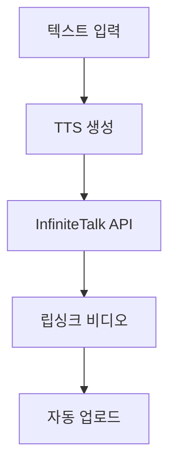

  
    InfiniteTalk <light-icon icon="video" size="72px"/>
  
  

    AI 립싱크 비디오 생성 가이드
  

---
layout: image-header-intro
imageHeader: /images/wangp-infinitetalk.png
imageRight: /images/wangp-infinitetalk.png
---

  InfiniteTalk이란?
  무제한 길이 음성 동기화 
  비디오 생성 AI 모델

- **MeiGen-AI 개발** - MultiTalk 후속 모델
- **무제한 길이** - 영상 길이 제한 없음
- **높은 정확도** - 기존 대비 우수한 립싱크
- **오픈소스** - GitHub에서 무료 제공

---

# 핵심 특징

  <light-icon icon="message-chatbot" size="48px" class="text-blue-400"/>
  <h3 class="text-lg font-bold mt-4">종합적 더빙</h3>
  
입술뿐만 아니라 머리 움직임, 몸짓, 표정까지 오디오와 동기화

  <light-icon icon="infinity" size="48px" class="text-green-400"/>
  <h3 class="text-lg font-bold mt-4">무제한 길이</h3>
  
영상 길이 제한 없이 생성 가능

  <light-icon icon="target" size="48px" class="text-purple-400"/>
  <h3 class="text-lg font-bold mt-4">높은 정확도</h3>
  
기존 MultiTalk 대비 우수한 립싱크와 안정성

<v-click>

  <light-icon icon="brand-github" size="24px"/> <a href="https://github.com/MeiGen-AI/InfiniteTalk" target="_blank">GitHub - MeiGen-AI/InfiniteTalk</a>

</v-click>

---

# 지원 기능

### 변환 모드

<v-clicks>

  <light-icon icon="photo" size="24px" class="text-blue-400"/>
  이미지 → 비디오
  
사진 + 오디오로 비디오 생성

  <light-icon icon="video" size="24px" class="text-green-400"/>
  비디오 → 비디오
  
기존 영상에 새 오디오 더빙

</v-clicks>

### 추가 옵션

<v-clicks>

  <light-icon icon="dimensions" size="24px" class="text-purple-400"/>
  다중 해상도
  
480P, 720P 지원

  <light-icon icon="users" size="24px" class="text-orange-400"/>
  다중 인물
  
여러 사람 동시 처리

</v-clicks>

---
layout: center
---

# 활용 분야

  <light-icon icon="microphone" size="36px" class="text-blue-400"/>
  <h3 class="text-sm font-bold mt-3">비디오 더빙</h3>

  <light-icon icon="user-circle" size="36px" class="text-green-400"/>
  <h3 class="text-sm font-bold mt-3">아바타 콘텐츠</h3>

  <light-icon icon="language" size="36px" class="text-purple-400"/>
  <h3 class="text-sm font-bold mt-3">다국어 비디오</h3>

  <light-icon icon="player-play" size="36px" class="text-orange-400"/>
  <h3 class="text-sm font-bold mt-3">인터랙티브 미디어</h3>

<v-click>

  교육 콘텐츠, 마케팅 영상, 팟캐스트 영상화 등 다양한 분야에 활용 가능

</v-click>

---
layout: dynamic-image
image: /images/pinokio-app.png
equal: false
left: false
---

# 왜 Pinokio인가?

### 원클릭 AI 앱 설치 플랫폼

<v-clicks>

- <light-icon icon="download" size="18px"/> **간편한 설치** - 복잡한 설정 없이 클릭만으로 설치
- <light-icon icon="package" size="18px"/> **의존성 관리** - Python, CUDA 등 자동 설치
- <light-icon icon="refresh" size="18px"/> **업데이트 관리** - 앱 업데이트 자동화
- <light-icon icon="apps" size="18px"/> **다양한 AI 앱** - ComfyUI, Wan2.1 등 지원

</v-clicks>

<v-click>

  <light-icon icon="circle-check" size="20px" class="text-green-400"/> 설치나 설정 스트레스가 없어서 좋았습니다!

</v-click>

<v-click>

  <a href="https://pinokio.co/" target="_blank" class="text-blue-400">https://pinokio.co/</a>

</v-click>

---

# 설치 워크플로우

전체 설치 과정 개요

  
1

  
Pinokio 설치

  
2

  
Wan2.1 설치

  
3

  
InfiniteTalk 선택

  
4

  
영상 생성

---
layout: dynamic-image
image: /images/pinokio-app.png
equal: true
left: false
---

# 1단계: Pinokio 설치

### 원클릭 AI 앱 매니저 설치

<v-clicks>

1. <a href="https://pinokio.co/" target="_blank">pinokio.co</a> 접속
2. 운영체제에 맞는 버전 다운로드
3. 설치 프로그램 실행
4. 설치 완료 후 Pinokio 실행

</v-clicks>

<v-click>

  <light-icon icon="info-circle" size="20px"/> Windows, macOS, Linux 모두 지원

</v-click>

---
layout: dynamic-image
image: /images/wan21-install.png
equal: true
left: false
---

# 2단계: Wan2.1 설치

### Pinokio에서 Wan2.1 앱 설치

<v-clicks>

1. Pinokio 앱 목록에서 **Wan2.1** 검색
2. **Install** 버튼 클릭
3. 필요한 모델 자동 다운로드 대기
4. 설치 완료 후 **Start** 클릭

</v-clicks>

<v-click>

  <light-icon icon="alert-triangle" size="20px"/> 모델 다운로드에 시간이 걸릴 수 있습니다

</v-click>

<v-click>

  <light-icon icon="cpu" size="20px"/> FusionX Lora 설치 후 설정값 수정하면 최적화 가능

</v-click>

---
layout: dynamic-image
image: /images/wangp-infinitetalk.png
equal: true
left: false
---

# 3단계: 영상 생성

### InfiniteTalk Single Speaker 480p 선택

<v-clicks>

1. Wan2.1 실행 후 Gradio UI 접속
2. **InfiniteTalk Single Speaker 480p** 선택
3. 이미지 또는 비디오 업로드
4. 오디오 파일 업로드
5. **Generate** 버튼 클릭

</v-clicks>

<v-click>

  <light-icon icon="settings" size="20px"/> 설정 조정으로 품질과 속도 조절 가능

</v-click>

---

# 결과

### 성능 비교

| 항목 | MultiTalk | InfiniteTalk |
|------|-----------|--------------|
| 설정 난이도 | 어려움 | 쉬움 (Pinokio) |
| 14초 영상 | 매우 오래 걸림 | **약 20분** |
| 길이 제한 | 있음 | 무제한 |
| 안정성 | 낮음 | 높음 |

<v-click>

### 실제 테스트 결과

  <light-icon icon="clock" size="24px" class="text-green-400"/>
  14초 영상 생성
  
약 20분

</v-click>

<v-click>

  <light-icon icon="circle-check" size="24px" class="text-blue-400"/>
  자동화 활용 가능
  
Gradio API 호출로 자동화 가능

</v-click>

---

# 자동화 가능성

### Gradio API 활용

<v-clicks>

- Wan2.1은 **Gradio** 기반 UI
- Gradio는 **API 자동 제공**
- Python, JavaScript 등으로 호출 가능
- POC 수준의 자동화 구현 가능

</v-clicks>

<v-click>

### 활용 시나리오

</v-click>

<v-click>

  <light-icon icon="robot" size="24px"/> 유튜브 자막 → AI 팟캐스트 동영상 완전 자동화 파이프라인 구축 가능

</v-click>

---

# 배운 점

<v-clicks>

  1. Pinokio가 설치를 혁신적으로 간편하게
  
복잡한 환경 설정 없이 클릭만으로 설치 완료

  2. InfiniteTalk는 실용적인 속도
  
MultiTalk 대비 훨씬 빠르고 안정적

  3. Gradio API로 자동화 가능
  
앱이나 자동화 파이프라인에 활용 가능

</v-clicks>

<v-click>

### 참고 자료

- [InfiniteTalk GitHub](https://github.com/MeiGen-AI/InfiniteTalk)
- [Pinokio 공식 사이트](https://pinokio.co/)
- [How To Install InfiniteTalk With WAN GP (YouTube)](https://www.youtube.com/watch?v=7Uaw0KVo2hs)
- [내 PC에서 무료로 말하는 영상 만들기 (YouTube)](https://www.youtube.com/watch?v=-VYppOorWhY)

</v-click>

---
layout: intro
image: /images/wangp-infinitetalk.png
---

  
    감사합니다 <light-icon icon="mood-smile" size="48px"/>
  
  

    InfiniteTalk + Pinokio로 
    AI 립싱크 비디오를 쉽게 만들어 보세요
  

  

    

      <light-icon icon="video" size="36px"/>
      
립싱크 비디오

    

    

      <light-icon icon="infinity" size="36px"/>
      
무제한 길이

    

    

      <light-icon icon="robot" size="36px"/>
      
자동화 가능

    

  

  

    Pinokio + Wan2.1 = 간편한 AI 비디오 생성
  

