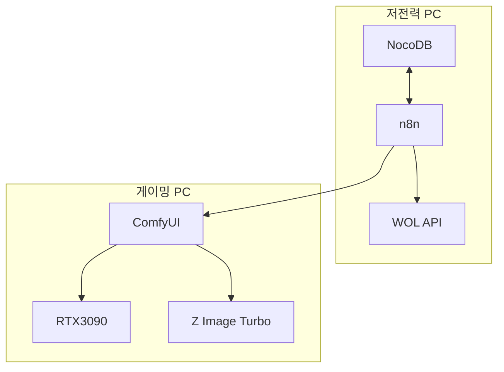

<div class="mb-4 absolute bottom-4 left-12">
  <span class="text-6xl text-primary-lighter text-opacity-80" style="font-weight:500;">
    ComfyUI 이미지 자동화 <light-icon icon="settings-automation" size="72px"/>
  </span>
  <div class="text-2xl text-primary-lighter text-opacity-60 font-bold mt-4">
    n8n으로 무인 대량 이미지 생성하기
  </div>
</div>

---
layout: image-header-intro
imageHeader: ./images/z-image-turbo.png
imageRight: ./images/z-image-turbo.png
---

<div class="leading-snug text-black dark:text-white">
  ComfyUI란?
  <span class="text-primary-lighter">노드 기반</span> 오픈소스<br/>
  이미지 생성 도구
</div>

<div class="text-secondary-lighter mt-4">

- **노드 기반 UI** - 시각적 워크플로우로 제어
- **Stable Diffusion** - 다양한 모델 지원
- **REST API 제공** - 외부에서 자동화 가능
- **오픈소스** - 무료로 사용 가능

</div>

---

# 왜 로컬 GPU인가?

<div class="grid grid-cols-2 gap-8 mt-8">

<div>

### 클라우드 서비스

<div class="p-4 bg-red-500/20 rounded-lg mt-4">
  <light-icon icon="cloud" size="32px" class="text-red-400"/>
  <div class="mt-2 text-red-300">매월 비용 발생</div>
  <div class="text-sm text-gray-400 mt-1">지속적인 지출</div>
</div>

</div>

<div>

### 로컬 GPU

<div class="p-4 bg-green-500/20 rounded-lg mt-4">
  <light-icon icon="cpu" size="32px" class="text-green-400"/>
  <div class="mt-2 text-green-300">초기 투자만</div>
  <div class="text-sm text-gray-400 mt-1">무료 사용</div>
</div>

</div>

</div>

<div class="mt-8">

<v-clicks>

- <light-icon icon="coin" size="18px"/> **비용 절감** - 클라우드 대비 추가 비용 없음
- <light-icon icon="bolt" size="18px"/> **성능** - RTX3090 GPU 직접 활용
- <light-icon icon="clock" size="18px"/> **무인 운영** - 새벽 시간에 자동 실행
- <light-icon icon="plug" size="18px"/> **효율적 리소스 관리** - 필요할 때만 PC를 켜서 전기료 절감
- <light-icon icon="arrows-maximize" size="18px"/> **확장성** - DB에서 생성할 이미지 양 조절

</v-clicks>

</div>

---
layout: center-image
image: ./images/workflow-overview.jpeg
---

# 목표 워크플로우

매일 새벽 완전 자동화 이미지 생성

<div class="mt-4">


</div>

---

# 시스템 구성

<div class="grid grid-cols-2 gap-6 h-[80%]">

<div>

### 역할에 따른 2대 PC 분리

| PC | 역할 | 특징 |
|---|---|---|
| **저전력 PC** | 스케줄링, 데이터 관리 | 24시간 상시 가동 |
| **게이밍 PC** | GPU 연산 (RTX3090) | 작업 시에만 가동 |

<v-click>

<div class="mt-4 p-3 bg-green-500/20 rounded-lg text-sm">

<light-icon icon="bolt" size="20px"/> **왜 분리하는가?**
- 고성능 GPU PC는 전력 소모가 큼
- 스케줄링은 저전력 PC로 충분
- **전기료 절감 + 효율적 운영**

</div>

</v-click>

</div>

<div class="flex items-center justify-center">
  
</div>

</div>

---
layout: dynamic-image
image: ./images/tasker-wol.png
equal: false
left: false
---

# 환경 구축: WOL 설정

### Wake-on-LAN으로 PC 원격 부팅

**Docker WOL API 서버** - `rix1337/docker-wol-api`

```yaml
# docker-compose.yml
services:
  wol-api:
    image: rix1337/docker-wol-api
    network_mode: host
    environment:
      - TZ=Asia/Seoul
    restart: unless-stopped
```

<v-click>

<div class="mt-4 p-2 bg-blue-500/20 rounded-lg text-sm">

```
n8n → HTTP Request → WOL API → Magic Packet → PC 부팅
```

</div>

</v-click>

---
layout: dynamic-image
image: ./images/vpn-ssh.png
equal: true
left: false
---

# 환경 구축: VPN & SSH

### 외부에서 안전하게 PC 접속

| 구성 요소 | 도구 | 목적 |
|---|---|---|
| **VPN 서버** | 시놀로지 VPN | 외부→내부 네트워크 |
| **SSH 서버** | OpenSSH | 원격 명령 실행 |

<v-click>

**설정 단계:**
1. 시놀로지 VPN 서버 설정
2. Windows에 OpenSSH 서버 설치
3. 방화벽 규칙 추가
4. VPN 연결 후 SSH 접속 테스트

```bash
ssh username@192.168.x.x
```

</v-click>

---
layout: dynamic-image
image: ./images/nocodb-ref.png
upperImage: ./images/nocodb-result.png
equal: false
left: false
---

# 환경 구축: NocoDB

### 오픈소스 노코드 데이터베이스

- Airtable과 유사한 스프레드시트 UI
- 관계형 기능 + REST API 제공
- 셀프호스팅 가능

<div class="mt-4">

| 테이블 | 용도 |
|--------|------|
| **참고 데이터** | 이미지 생성 시 참고할 정보 |
| **생성 결과** | 생성된 이미지와 메타데이터 |

</div>

---
layout: dynamic-image
image: ./images/z-image-turbo.png
equal: true
left: false
---

# ComfyUI 설치

### 설치 옵션 비교

| 방법 | 도구 | 특징 |
|---|---|---|
| **옵션 1** | Stability Matrix | 패키지 매니저, 초보자 친화적 |
| **옵션 2** | 직접 설치 | 가볍고, 커스터마이징 자유 |

<v-click>

### Z Image Turbo 모델

- <light-icon icon="bolt" size="18px"/> **빠른 속도**: RTX3090에서 **5초 이내**
- <light-icon icon="cpu" size="18px"/> **적은 메모리**: 6GB 미만 사용
- <light-icon icon="photo" size="18px"/> **준수한 품질**: 블로그, SNS용으로 충분

</v-click>

<v-click>

<div class="mt-4 p-3 bg-green-500/20 rounded-lg">
  <light-icon icon="flash" size="20px"/> 1024×1024 기준 5초 이내 생성
</div>

</v-click>

---

# SSH를 통한 ComfyUI 원격 실행

**가장 어려웠던 부분** - SSH 종료 시 ComfyUI도 함께 종료되는 문제

<div class="grid grid-cols-2 gap-8 mt-6">

<div>

### 시행착오

| 시도 | 방법 | 결과 |
|:---:|------|:---:|
| 1차 | `start /B` (배치파일) | <light-icon icon="circle-x" size="20px" class="text-red-500"/> |
| 2차 | `Start-Process` | <light-icon icon="circle-x" size="20px" class="text-red-500"/> |
| 3차 | Task Scheduler | <light-icon icon="alert-triangle" size="20px" class="text-yellow-500"/> |
| **최종** | **WMI 방식** | <light-icon icon="circle-check" size="20px" class="text-green-500"/> |

</div>

<div>

### 문제 상황

```
SSH 세션 시작
    ↓
ComfyUI 실행
    ↓
SSH 세션 종료
    ↓
ComfyUI도 함께 종료 ❌
```

</div>

</div>

<v-click>

<div class="mt-4 text-center text-xl text-green-400">
  <light-icon icon="circle-check" size="28px"/> WMI (Windows Management Instrumentation) 방식으로 해결!
</div>

</v-click>

---

# WMI 방식 해결책

SSH 세션과 완전히 독립적인 프로세스 생성

```powershell {all|1|2-5|6|all}
$process = Get-Process python -ErrorAction SilentlyContinue | Where-Object {$_.Path -like "*ComfyUI*"}
if (-not $process) {
    $cmd = 'F:\StabilityMatrix\Data\Packages\ComfyUI\venv\Scripts\python.exe
           F:\StabilityMatrix\Data\Packages\ComfyUI\main.py --listen 0.0.0.0 --port 8188'
    Invoke-WmiMethod -Class Win32_Process -Name Create -ArgumentList $cmd | Out-Null
    Write-Output 'ComfyUI started'
} else {
    Write-Output 'ComfyUI already running'
}
```

<div class="grid grid-cols-3 gap-4 mt-6">

<div v-click class="p-4 bg-blue-500/20 rounded-lg text-center">
  <light-icon icon="server" size="28px"/>
  <div class="text-sm mt-2"><code>Invoke-WmiMethod</code>로<br/><strong>시스템 레벨</strong> 프로세스 생성</div>
</div>

<div v-click class="p-4 bg-green-500/20 rounded-lg text-center">
  <light-icon icon="link" size="28px"/>
  <div class="text-sm mt-2">SSH 세션과<br/><strong>완전히 독립적</strong> 실행</div>
</div>

<div v-click class="p-4 bg-purple-500/20 rounded-lg text-center">
  <light-icon icon="refresh" size="28px"/>
  <div class="text-sm mt-2"><strong>중복 실행 방지</strong><br/>로직 포함</div>
</div>

</div>

---
layout: dynamic-image
image: ./images/python-api-test.png
equal: true
left: false
---

# Python API 테스트

### n8n 연동 전 Python으로 먼저 검증

<v-clicks>

- <light-icon icon="photo" size="18px"/> **단일 이미지 생성** - 하나의 프롬프트로 이미지 1장
- <light-icon icon="photos" size="18px"/> **배치 이미지 생성** - 여러 프롬프트로 대량 생성

</v-clicks>

<v-click>

```python
import requests

def generate_image(prompt):
    workflow = load_workflow()
    workflow["prompt"] = prompt

    response = requests.post(
        "http://localhost:8188/prompt",
        json={"prompt": workflow}
    )
    return response.json()
```

</v-click>

---
layout: dynamic-image
image: ./images/n8n-workflow.png
equal: false
left: false
---

# n8n 워크플로우 구성

### 전체 자동화 파이프라인 완성

<div class="grid grid-cols-7 gap-1 text-center text-xs mt-4">

<div class="p-2 bg-green-500/30 rounded">
  <div class="font-bold">1</div>
  <div>Schedule</div>
</div>

<div class="p-2 bg-blue-500/30 rounded">
  <div class="font-bold">2</div>
  <div>NocoDB</div>
</div>

<div class="p-2 bg-yellow-500/30 rounded">
  <div class="font-bold">3</div>
  <div>WOL</div>
</div>

<div class="p-2 bg-purple-500/30 rounded">
  <div class="font-bold">4</div>
  <div>SSH</div>
</div>

<div class="p-2 bg-pink-500/30 rounded">
  <div class="font-bold">5</div>
  <div>API</div>
</div>

<div class="p-2 bg-blue-500/30 rounded">
  <div class="font-bold">6</div>
  <div>저장</div>
</div>

<div class="p-2 bg-red-500/30 rounded">
  <div class="font-bold">7</div>
  <div>종료</div>
</div>

</div>

<v-click>

<div class="mt-6">

**PC 종료 명령:**

```powershell
shutdown /s /t 60 /f
```

</div>

</v-click>

---
layout: dynamic-image
image: ./images/kakao-bot-1.png
upperImage: ./images/kakao-bot-2.png
equal: false
left: false
---

# 보너스: 카톡봇 연동

### 카카오톡으로 이미지 생성 명령

<v-clicks>

1. <light-icon icon="message" size="18px"/> **카톡 메시지**로 프롬프트 전송
2. <light-icon icon="settings-automation" size="18px"/> **n8n**이 메시지 받아서 ComfyUI API 호출
3. <light-icon icon="cloud-upload" size="18px"/> 생성된 이미지를 **구글 드라이브**에 업로드
4. <light-icon icon="send" size="18px"/> 공유 URL을 **카톡으로 회신**

</v-clicks>

<v-click>

<div class="mt-4 p-3 bg-yellow-500/20 rounded-lg text-sm">
  <light-icon icon="mood-smile" size="20px"/> 실용성은... 하지만 재미있는 실험!
</div>

</v-click>

---
layout: dynamic-image
image: ./images/sample-1.png
upperImage: ./images/sample-2.png
equal: true
left: false
---

# 생성된 이미지 샘플

### Z Image Turbo 모델로 자동 생성

<div class="mt-8">

<v-clicks>

- <light-icon icon="clock" size="18px"/> RTX3090에서 **5초 이내** 생성
- <light-icon icon="dimensions" size="18px"/> **1024×1024** 해상도
- <light-icon icon="photo" size="18px"/> 블로그, SNS용으로 충분한 품질

</v-clicks>

</div>

<v-click>

<div class="mt-6 p-3 bg-green-500/20 rounded-lg">
  <light-icon icon="sparkles" size="20px"/> 매일 새벽 자동으로 대량 생성
</div>

</v-click>

---

# 결과 및 배운 점

<div class="grid grid-cols-2 gap-12 h-full">

<div>

### 주요 성과

<v-clicks>

<div class="p-3 bg-green-500/20 rounded-lg mb-3">
  <light-icon icon="circle-check" size="20px" class="text-green-400"/> **자동화 구현 확인**<br/>
  <span class="text-sm text-gray-400">주기적 대량 이미지 자동 생성 검증</span>
</div>

<div class="p-3 bg-green-500/20 rounded-lg mb-3">
  <light-icon icon="circle-check" size="20px" class="text-green-400"/> **완전 자동화 달성**<br/>
  <span class="text-sm text-gray-400">무인으로 생성 → 저장 → PC 종료</span>
</div>

<div class="p-3 bg-green-500/20 rounded-lg">
  <light-icon icon="circle-check" size="20px" class="text-green-400"/> **효율적인 리소스 관리**<br/>
  <span class="text-sm text-gray-400">게이밍PC는 작업 시에만 가동</span>
</div>

</v-clicks>

</div>

<div>

### 배운 점

<v-clicks>

<div class="p-3 bg-blue-500/20 rounded-lg mb-3">
  <span class="font-bold">1. ComfyUI는 생각보다 쉽다</span><br/>
  <span class="text-sm text-gray-400">설치와 기존 워크플로우 사용이 어렵지 않음</span>
</div>

<div class="p-3 bg-blue-500/20 rounded-lg mb-3">
  <span class="font-bold">2. Z Image Turbo는 실용적</span><br/>
  <span class="text-sm text-gray-400">블로그, SNS 이미지 용도로 완벽</span>
</div>

<div class="p-3 bg-blue-500/20 rounded-lg">
  <span class="font-bold">3. 자동화는 n8n이 편하다</span><br/>
  <span class="text-sm text-gray-400">스케줄링 내장, 비주얼 워크플로우가 직관적</span>
</div>

</v-clicks>

</div>

</div>

---

# 앞으로의 계획

<div class="grid grid-cols-2 gap-6 mt-8">

<div v-click class="p-6 bg-gray-800/50 rounded-lg border border-gray-700">
  <light-icon icon="chart-line" size="36px" class="text-blue-400"/>
  <h3 class="text-lg font-bold mt-3">프롬프트 품질 개선</h3>
  <p class="text-gray-400 text-sm mt-2">LLM을 활용한 더 정교한 프롬프트 생성</p>
</div>

<div v-click class="p-6 bg-gray-800/50 rounded-lg border border-gray-700">
  <light-icon icon="video" size="36px" class="text-green-400"/>
  <h3 class="text-lg font-bold mt-3">영상 생성 모델 테스트</h3>
  <p class="text-gray-400 text-sm mt-2">이미지 외에 영상 생성도 자동화</p>
</div>

<div v-click class="p-6 bg-gray-800/50 rounded-lg border border-gray-700">
  <light-icon icon="api" size="36px" class="text-purple-400"/>
  <h3 class="text-lg font-bold mt-3">MCP 서버화</h3>
  <p class="text-gray-400 text-sm mt-2">다양한 곳에서 활용할 수 있도록 MCP로 구현</p>
</div>

<div v-click class="p-6 bg-gray-800/50 rounded-lg border border-gray-700">
  <light-icon icon="terminal-2" size="36px" class="text-orange-400"/>
  <h3 class="text-lg font-bold mt-3">Claude Code 연동</h3>
  <p class="text-gray-400 text-sm mt-2">n8n은 트리거만, SSH로 Claude Code 실행</p>
</div>

</div>

---

# 기술 스택 정리

<div class="grid grid-cols-2 gap-8">

<div>

| 카테고리 | 기술/도구 | 역할 |
|---|---|---|
| <light-icon icon="cpu" size="16px"/> **하드웨어** | RTX3090 윈도우PC | GPU 연산 |
| <light-icon icon="photo" size="16px"/> **이미지 생성** | ComfyUI + Z Image Turbo | 이미지 생성 |
| <light-icon icon="settings-automation" size="16px"/> **자동화** | n8n | 워크플로우 자동화 |
| <light-icon icon="database" size="16px"/> **데이터베이스** | NocoDB | 프롬프트/결과 관리 |
| <light-icon icon="wifi" size="16px"/> **원격 제어** | WOL, VPN, SSH | PC 원격 관리 |

</div>

<div>



</div>

</div>

---
layout: intro
image: ./images/sample-1.png
---

<div class="mb-4 absolute bottom-4 left-12">
  <span class="text-5xl text-primary-lighter text-opacity-80" style="font-weight:500;">
    마치며 <light-icon icon="heart" size="48px"/>
  </span>
  <div class="text-xl text-primary-lighter text-opacity-60 mt-4">
    셀프 호스팅과 보유 하드웨어를 활용해서<br/>
    뭔가를 해보는 것은 즐거운 경험입니다
  </div>
  <div class="mt-8 flex gap-8">
    <div class="text-center">
      <light-icon icon="camera" size="36px"/>
      <div class="text-sm mt-1">블로그 썸네일</div>
    </div>
    <div class="text-center">
      <light-icon icon="device-mobile" size="36px"/>
      <div class="text-sm mt-1">SNS 콘텐츠</div>
    </div>
    <div class="text-center">
      <light-icon icon="palette" size="36px"/>
      <div class="text-sm mt-1">다양한 이미지</div>
    </div>
  </div>
  <div class="mt-6 text-2xl text-green-400 font-bold">
    ComfyUI + n8n = 코딩 없이 강력한 이미지 생성 자동화
  </div>
</div>

---
layout: intro
image: ./images/workflow-overview.jpeg
---

<div class="mb-4 absolute bottom-4 left-12">
  <span class="text-5xl text-primary-lighter text-opacity-80" style="font-weight:500;">
    감사합니다 <light-icon icon="mood-smile" size="48px"/>
  </span>
  <div class="text-lg text-primary-lighter text-opacity-60 mt-6">
    <p class="font-bold mb-2">참고 자료</p>
    <ul class="text-sm space-y-1">
      <li><a href="https://www.comfy.org/" target="_blank">ComfyUI 공식 사이트</a></li>
      <li><a href="https://github.com/Comfy-Org/ComfyUI" target="_blank">ComfyUI GitHub</a></li>
      <li><a href="https://lykos.ai/" target="_blank">Stability Matrix</a></li>
      <li><a href="https://docs.n8n.io/" target="_blank">n8n 공식 문서</a></li>
      <li><a href="https://nocodb.com/" target="_blank">NocoDB</a></li>
    </ul>
  </div>
</div>
